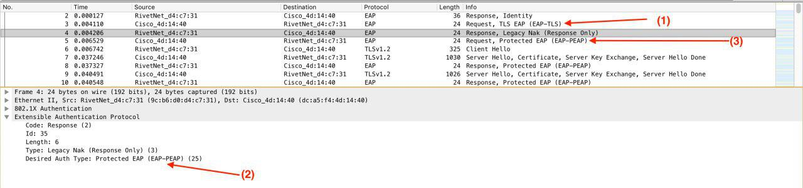

- [Livrables](https://github.com/arubinst/HEIGVD-SWI-Labo3-WPA-Entreprise#livrables)

- [Échéance](https://github.com/arubinst/HEIGVD-SWI-Labo3-WPA-Entreprise#échéance)

- [Quelques éléments à considérer](https://github.com/arubinst/HEIGVD-SWI-Labo3-WPA-Entreprise#quelques-éléments-à-considérer-)

- [Travail à réaliser](https://github.com/arubinst/HEIGVD-SWI-Labo3-WPA-Entreprise#travail-à-réaliser)

# Sécurité des réseaux sans fil

## Laboratoire 802.11 Sécurité WPA Entreprise

__A faire en équipes de deux personnes__

### Objectif :

1.	Analyser les étapes d’une connexion WPA Entreprise avec une capture Wireshark
2.	Implémenter une attaque WPE (Wireless Pwnage Edition) contre un réseau WPA Entreprise

__Il est fortement conseillé d'employer une distribution Kali__ (on ne pourra pas assurer le support avec d'autres distributions). __Si vous utilisez une VM, il vous faudra une interface WiFi usb, disponible sur demande__.

__ATTENTION :__ Il est __particulièrement important pour ce laboratoire__ de bien fixer le canal lors de vos captures et vos injections. Si vous en avez besoin, la méthode la plus sure est de lancer un terminal séparé, et d'ouvrir airodump-ng avec l'option :

```--channel```

Il faudra __garder la fenêtre d'airodump ouverte__ en permanence pendant que vos scripts tournent ou vos manipulations sont effectuées.

## Travail à réaliser

### 1. Capture et analyse d’une authentification WPA Entreprise

Dans cette première partie, vous allez capturer une connexion WPA Entreprise au réseau de l’école avec Wireshark et fournir des captures d’écran indiquant dans chaque capture les données demandées.

- Identifier le canal utilisé par l’AP dont la puissance est la plus élevée. Vous pouvez faire ceci avec ```airodump-ng```, par exemple
- Lancer une capture avec Wireshark
- Etablir une connexion depuis un poste de travail (PC), un smartphone ou une tablette. Attention, il est important que la connexion se fasse à 2.4 GHz pour pouvoir sniffer avec les interfaces Alfa.
- Comparer votre capture au processus d’authentification expliqué en classe (n’oubliez pas les captures !). En particulier, identifier les étapes suivantes :
	- Requête et réponse d’authentification système ouvert
 	- Requête et réponse d’association
	- Sélection de la méthode d’authentification
	- Phase d’initiation. Arrivez-vous à voir l’identité du client ?
	- Phase hello :
		- Version TLS
		- Suites cryptographiques et méthodes de compression proposées par le client et acceptées par l’AP
		- Nonces
		- Session ID
	- Phase de transmission de certificats
	 	- Certificat serveur
		- Change cipher spec
	- Authentification interne et transmission de la clé WPA (échange chiffré, vu comme « Application data »)
	- 4-way hadshake

### Répondez aux questions suivantes :

> **_Question :_** Quelle ou quelles méthode(s) d’authentification est/sont proposé(s) au client ?
>
> **_Réponse :_** 
>
> (1) L'AP propose au client d'utiliser la méthode EAP-TLS
>
> (2) Le client indique qu'il préfère la méthode d'authentification EAP-PEAP
>
> (3) L'AP accepte la méthode EAP-PEAP proposé par le client
>
> 
>
> 
>
> 

---

> **_Question:_** Quelle méthode d’authentification est utilisée ?
> 
> **_Réponse:_** EAP-PEAP

---

> **_Question:_** Lors de l’échange de certificats entre le serveur d’authentification et le client :
>
> - Le serveur envoie-t-il un certificat au client ? Pourquoi oui ou non ?
>
> **_Réponse:_**
>
> Oui il envoie un certificat car c'est dans le but d'identifier le serveur Radius auprès du client. Le certificat permet également de créer une communication chiffrée.
> C'est grâce à ce certificat que les infos des prochains échanges sont notés "Application Data". Ces échanges sont chiffrés et il est impossible pour un attaquant de voir les données.
> Ce certificat permet donc de chiffrer (sécuriser) l'authentification MS-CHAP.
>
> 
>
> - b.	Le client envoie-t-il un certificat au serveur ? Pourquoi oui ou non ?
>
> **_Réponse:_**
>
> Non parce que le client n'utilise pas EAP-TLS, il utilise EAP-PEAP. Ce qui veut dire que l'authentification se passe en MS-CHAP  (avec un challenge) en EAPOL.

---

### 2. Attaque WPA Entreprise

Les réseaux utilisant une authentification WPA Entreprise sont considérés aujourd’hui comme étant très surs. En effet, puisque la Master Key utilisée pour la dérivation des clés WPA est générée de manière aléatoire dans le processus d’authentification, les attaques par dictionnaire ou brute-force utilisés sur WPA Personnel ne sont plus applicables. 

Il existe pourtant d’autres moyens pour attaquer les réseaux Entreprise, se basant sur une mauvaise configuration d’un client WiFi. En effet, on peut proposer un « evil twin » à la victime pour l’attirer à se connecter à un faux réseau qui nous permette de capturer le processus d’authentification interne. Une attaque par brute-force peut être faite sur cette capture, beaucoup plus vulnérable d’être craquée qu’une clé WPA à 256 bits, car elle est effectuée sur le compte d’un utilisateur.

Pour faire fonctionner cette attaque, il est impératif que la victime soit configurée pour ignorer les problèmes de certificats ou que l’utilisateur accepte un nouveau certificat lors d’une connexion.

Pour implémenter l’attaque :

- Installer ```hostapd-wpe``` (il existe des versions modifiées qui peuvent peut-être faciliter la tâche... je ne les connais pas. Dans le doute, utiliser la version originale). Lire la documentation du site de l’outil ou d’autres ressource sur Internet pour comprendre son utilisation
- Modifier la configuration de ```hostapd-wpe``` pour proposer un réseau semblable au réseau de l’école. Ça ne sera pas evident de vous connecter si vous utilisez le même nom HEIG-VD. L'option la plus sure c'est de proposer votre propre réseau avec un SSID comme par exemple, HEIG-VD-Faux (sachant que dans le cas d'une attaque réelle, il faudrait utiliser le vrai SSI) 
- Lancer une capture Wireshark
- Tenter une connexion au réseau (ne pas utiliser vos identifiants réels)
- Utiliser un outil de brute-force (```john```, par exemple) pour attaquer le hash capturé (utiliser un mot de passe assez petit pour minimiser le temps)

### Répondez aux questions suivantes :

> **_Question :_** Quelles modifications sont nécessaires dans la configuration de hostapd-wpe pour cette attaque ?
> 
> **_Réponse :_** 

Le fichier se trouve dans le dossier ``/etc`` => ``/etc/hostapd-wpe``
Dans ce fichier on va pouvoir définir le nom du SSID diffusé et le canal.
Il est également nécessaire de définir l'interface d'écoute.

```shell
# Interface ...
interface=wlan0mon

# ...

# 802.11 Options
ssid=HEIG-VD-Zbeubzbeub
channel=1
```

Mettre également l'interface en monitor

```shell
sudo airmon-ng start wlan0mon
```

```shell
Configuration file: /etc/hostapd-wpe/hostapd-wpe.conf
Using interface wlan0mon with hwaddr 00:c0:ca:90:01:b9 and ssid "HEIG-VD-Zbeubzbeub"
```

> Question:_** Quel type de hash doit-on indiquer à john pour craquer le handshake ?
> 
> **_Réponse:_** 

```shell
mschapv2: Sun Jun  2 08:47:19 2019
	 username:	labinot
	 challenge:	09:80:5b:35:c3:9b:76:43
	 response:	ec:dd:e1:2f:6e:0d:8b:7c:75:f2:64:c6:f6:60:fa:05:2c:23:26:b7:f8:5f:86:c1
	 jtr NETNTLM:		labinot:$NETNTLM$09805b35c39b7643$ecdde12f6e0d8b7c75f264c6f660fa052c2326b7f85f86c1
	 hashcat NETNTLM:	labinot::::ecdde12f6e0d8b7c75f264c6f660fa052c2326b7f85f86c1:09805b35c39b7643	 
	 
wlan0mon: STA 4c:d1:a1:2f:d7:33 IEEE 802.1X: Identity received from STA: 'labinot'
wlan0mon: STA 4c:d1:a1:2f:d7:33 IEEE 802.1X: Identity received from STA: 'labinot'
```

``NETNTLM``

On voit dans la caputre d'écran ci-dessus :

* Le username de l'utilisateur
* Un hash de son mot de passe
* Le challenge envoyé par le serveur d'authentification

> **_Question:_** 6.	Quelles méthodes d’authentification sont supportées par hostapd-wpe ?
> 
> **_Réponse:_**

1. EAP-FAST/MSCHAPv2 (Phase 0)
2. PEAP/MSCHAPv2
3. EAP-TTLS/MSCHAPv2
4. EAP-TTLS/MSCHAP
5. EAP-TTLS/CHAP
6. EAP-TTLS/PAP


Configuration

```shell
sudo john --format=netntlm hash.txt
```


## Quelques éléments à considérer :

- Solution à l’erreur éventuelle « ```Could not configure driver mode``` » :

```
nmcli radio wifi off
rfkill unblock wlan
```
-	Pour pouvoir capturer une authentification complète, il faut se déconnecter d’un réseau et attendre 1 minute (timeout pour que l’AP « oublie » le client) 
-	Les échanges d’authentification entreprise peuvent être trouvés facilement utilisant le filtre d’affichage « ```eap``` » dans Wireshark


## Livrables

Un fork du repo original . Puis, un Pull Request contenant :

-	Captures d’écran + commentaires
-	Réponses aux questions

# Référance

https://whiteflag.blog/2018/11/19/hostapd-wpe-attaquer-un-reseau-wi-fi-dentreprise/


## Échéance

Le 26 mai 2019 à 23h00